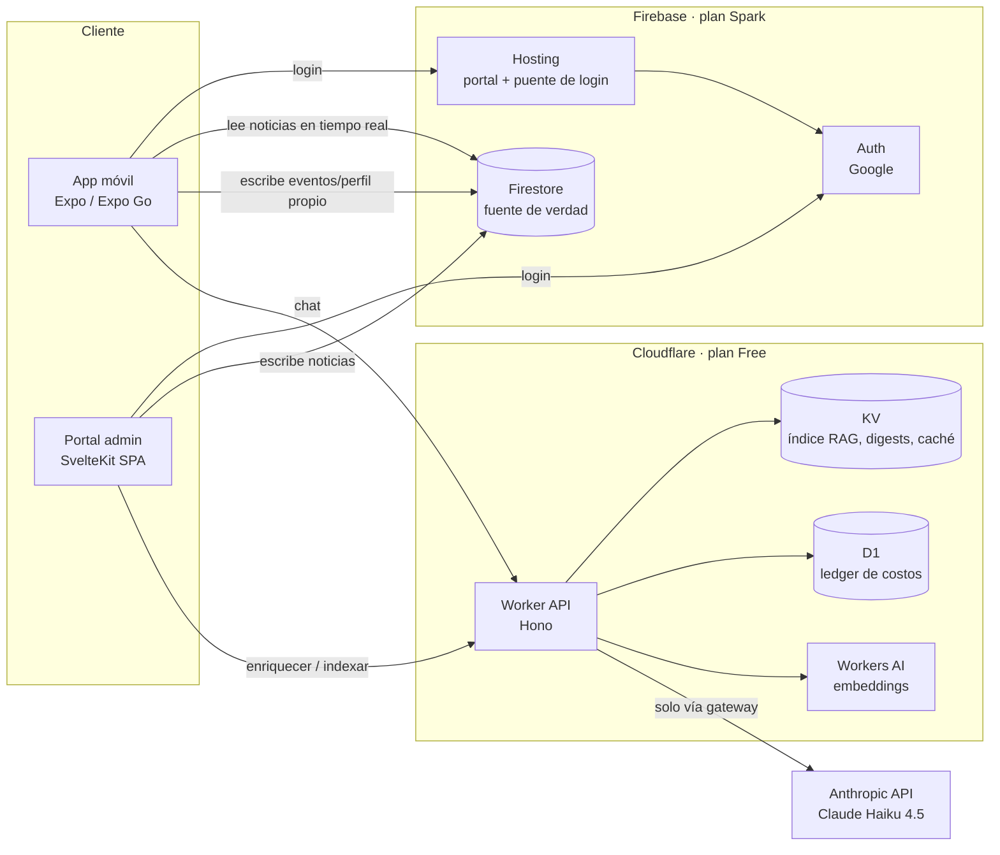

# Arquitectura

## 1. Vista general



## 2. Responsabilidades

| Componente | Hace | No hace |
|------------|------|---------|
| App móvil | Login, elegir ubicación, feed (ranking local con `packages/shared`), lectura, registrar señales, chat UI | Llamar a LLMs directamente; calcular certeza |
| Portal | CRUD de noticias, fuentes, verificación, imágenes, publicar, comparador, dashboard de costos | Guardar API keys de IA |
| Firestore | Fuente de verdad: noticias, fuentes, versiones, usuarios, eventos | Búsqueda semántica |
| Worker | Verificar ID tokens de Firebase, gateway de IA, enriquecimiento, índice RAG, chat, digests, ledger, kill switch | Escribir en Firestore (no tiene Admin SDK; ver ADR-004) |
| KV | Índice derivado para el chat (embeddings + texto recortado), digests por región, caché de respuestas | Ser fuente de verdad |
| D1 | Ledger de cada llamada de IA, agregados de costo, rate limit por usuario | Contenido de noticias |

## 3. Flujos principales

### 3.1 Publicar (la IA trabaja aquí)

1. Editor crea borrador en el portal → Firestore `news/{id}` con `workflow = borrador`.
2. Editor pulsa "Sugerir con IA" → `POST /admin/enrich` → el Worker devuelve sugerencias (temas, alcance geo,
   importancia, afirmaciones verificables, resumen) marcadas como sugerencias. **Una sola llamada LLM por noticia.**
3. Editor acepta/edita sugerencias, carga fuentes, resuelve imagen, completa checklist.
4. Editor elige certeza (`confirmada` / `en_desarrollo` / `disputada`) respetando reglas de fuentes y publica.
5. Portal escribe `workflow = publicada` y llama `POST /admin/index/upsert` → el Worker calcula embedding
   (Workers AI, sin costo de créditos) y actualiza el índice en KV; invalida digests afectados.
6. Firestore empuja la noticia a todos los teléfonos suscritos (listener en tiempo real).

### 3.2 Leer (el código trabaja aquí, costo IA = 0)

1. App escucha `news` publicadas de las últimas N horas (N configurable, default 72) + todas las `esencial`.
2. `rankFeed(news, userProfile, location, now)` en `packages/shared` calcula puntajes, aplica reglas anti-burbuja y
   asigna niveles de layout. Detalle: `docs/domain/RELEVANCIA.md`.
3. Cada tarjeta lleva su explicación ("¿Por qué veo esto?") generada por código desde los componentes del puntaje.
4. Las interacciones (abrir, tiempo de lectura, "menos de esto") se guardan en `users/{uid}/events` y actualizan
   `users/{uid}.interests` con reglas deterministas.

### 3.3 Preguntar (IA solo cuando aporta)

1. `POST /chat` con la pregunta, ubicación e historial corto de la sesión (en memoria del cliente, no persistido).
2. Worker: auth → rate limit → presupuesto → ruteo por intención (código) → embedding de la pregunta → búsqueda en KV.
3. Si nada supera el umbral → **abstención sin llamar al LLM**.
4. Si hay caché → devuelve caché.
5. Si no → 1 llamada LLM con salida estructurada → validación de citas en código → estado de certeza heredado de la
   noticia → respuesta. Detalle: `docs/domain/CHAT-RAG.md`.

## 4. Autenticación

- **Móvil:** Expo Go no puede usar el Google Sign-In nativo. Usamos un **puente web**: la app abre
  `https://<proyecto>.web.app/auth/mobile` en un navegador de sistema (`expo-web-browser`), la página hace login con
  Google usando el SDK web de Firebase y devuelve el `id_token` de Google a la app por deep link (en el fragmento `#`,
  nunca en query). La app llama `signInWithCredential(GoogleAuthProvider.credential(idToken))`.
  Detalle y controles de seguridad: `docs/ops/IOS-ANDROID-DISTRIBUCION.md` §3.
- **Portal:** `signInWithPopup` de Firebase con Google. Acceso de escritura solo si `admins/{uid}` existe (reglas).
- **Worker:** verifica el Firebase ID token con `jose` contra el JWKS público de `securetoken@system.gserviceaccount.com`,
  `iss = https://securetoken.google.com/<projectId>`, `aud = <projectId>`. Endpoints `/admin/*` exigen además que el
  `uid` esté en el secret `ADMIN_UIDS`.

## 5. Proveedores de IA por tarea (configurable)

El gateway resuelve proveedor y modelo por **tarea**, no por endpoint. Esto permite cambiar una tarea a otro modelo
(incluido Jev para el laboratorio de rediseño) sin tocar la lógica.

| Tarea (`AiTask`) | Default | Alternativas | Notas |
|------------------|---------|--------------|-------|
| `embed` | Workers AI `@cf/baai/bge-m3` (multilingüe) | — | Verificar nombre exacto del modelo y cuota gratuita en F1 |
| `enrich` | Anthropic `claude-haiku-4-5-20251001`, salida JSON | Jev (Choice/Score/Noul) para temas, geo, importancia | Una llamada por noticia |
| `chat_answer` | Anthropic `claude-haiku-4-5-20251001` | Modelo de Workers AI (costo 0, calidad menor) | Único uso en lectura |
| `digest` | Anthropic `claude-haiku-4-5-20251001` | — | Precalculado al publicar |
| `image_generate` | Deshabilitado por defecto | Workers AI (modelo de imagen) | Último recurso, ver IMAGENES.md |

Configuración en `services/api/src/ai/config.ts`. Modo `AI_MODE=mock` devuelve respuestas fijas para desarrollo.

## 6. Por qué no hay LLM en el feed

- Costo: el feed se abre decenas de veces por usuario; el ranking por código cuesta 0.
- Latencia: el feed responde instantáneo y se actualiza en tiempo real.
- Explicabilidad: una fórmula con componentes permite explicar exactamente "por qué veo esto".
- Auditoría: el mismo motor corre en la app, en el comparador del portal y en las pruebas, con resultados idénticos.

## 7. Estructura del repositorio

```
apps/
  mobile/            Expo + expo-router
    app/             (tabs)/chat.tsx (inicial), (tabs)/feed.tsx, news/[id].tsx, location.tsx, login.tsx
    src/             hooks, componentes, servicios (firebase, api)
  admin/             SvelteKit SPA
    src/routes/      login, news/, news/[id], compare/, costs/, auth/mobile (puente)
services/
  api/               Cloudflare Worker (Hono)
    src/ai/          gateway.ts, config.ts, pricing.ts, providers/*, prompts/*
    src/routes/      chat.ts, admin.ts, health.ts
    src/rag/         index.ts, search.ts, validate.ts
    migrations/      D1 SQL
packages/
  shared/            types.ts, schemas.ts, catalogs/, ranking/, explain/
evals/               chat-golden.jsonl, run-chat-evals.ts, ranking-personas.test.ts
evidence/            loops/, capturas, métricas exportadas
docs/                (este directorio)
```
